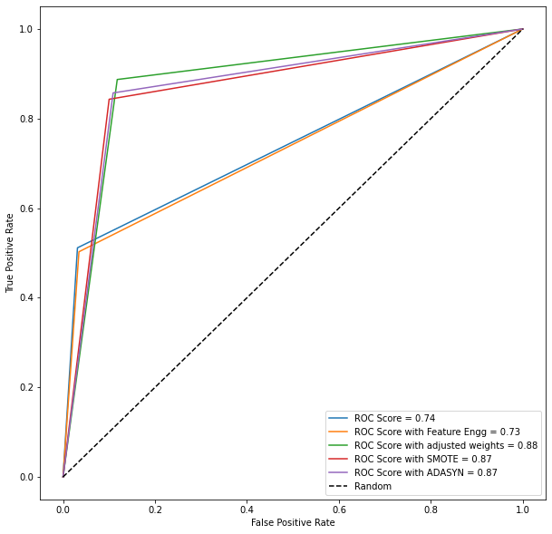

# banking-deposit
A banking institution is running a direct marketing campaign. The campaign involves making a phone call to a customer, often multiple times to ensure a product subscription, in this case a term deposit. Term deposits are usually short-term deposits with maturities ranging from one month to a few years. Various details about the customer is collected employment status, marital status, loan, the duration of the call etc. The customer signed up or not for the term deposit as a result of the campaign is collected as well. The problem we looking to solve is to build a classification model to predict if a customer will subscribe to a term deposit or not. We are also looking what features influence a customer decision to buy and what segments should we focus on to increase more subscription

During Model development various techniques were employed XGBoost with deafault paramters, Featuere Engineering with XGBoost, Class weights adjustment as the dataset was imbalanced with more No sample than Yes sample, SMOTE technique was applied to upsample the data by increasing the minortiy class samples

